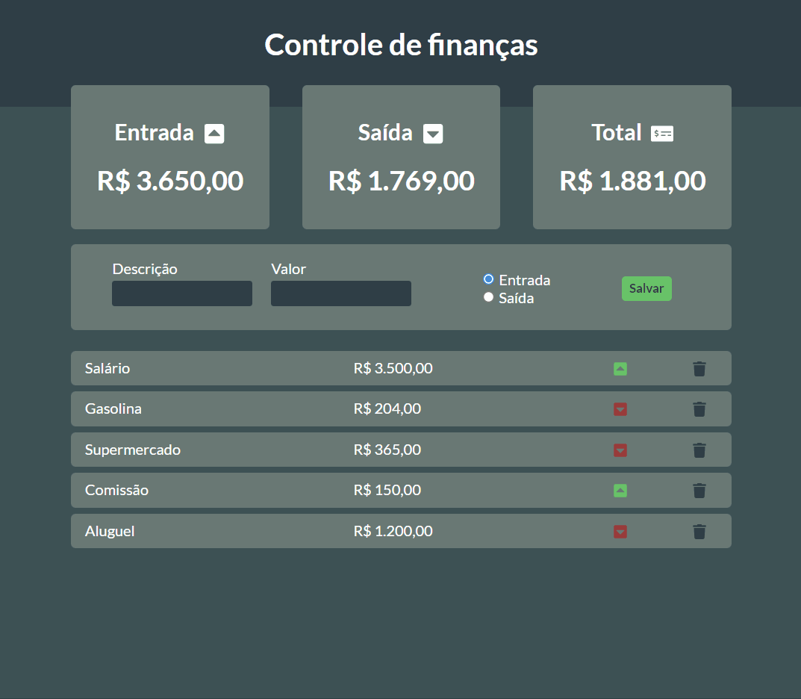
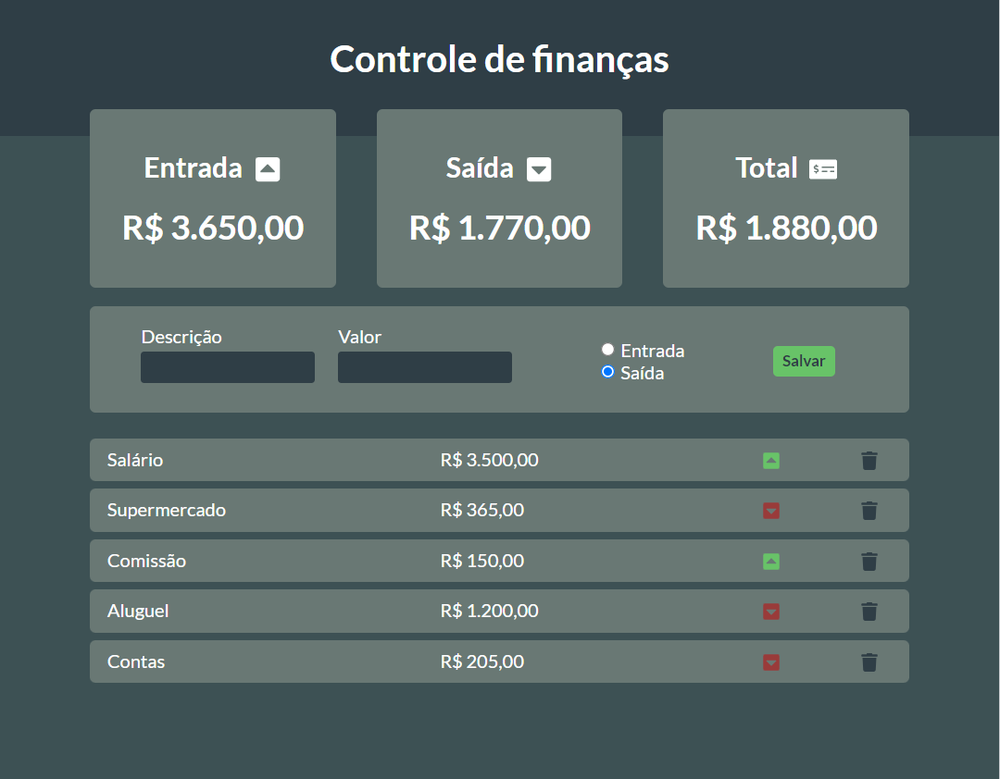

<h1 align="center">Sistema de controle de finanças</h1>
<h4 align="center">Tenha total controle de sua vida financeira com nosso sistema!</h4>
<h4 align="center">Feito com React.js</h4>

 &#xa0;

**
Sumário
**

<a href="#dart-sobre">Sobre</a> &#xa0; | &#xa0;
<a href="#white_check_mark-funcionalidades">Funcionalidades</a> &#xa0; | &#xa0;
<a href="#computer-tecnologias">Tecnologias</a> &#xa0; | &#xa0;
<a href="#hammer_and_wrench-serviços">Serviços</a>

<a href="#camera-imagens">Imagens</a> &#xa0; | &#xa0;
<a href="#orange_book-como-usar">Como usar</a> &#xa0; | &#xa0;
<a href="#scroll-pré-requisitos">Pré-requisitos</a> &#xa0; | &#xa0;
<a href="#link-links">Links</a> &#xa0; | &#xa0;
<a href="#sparkles-autor">Autor</a>

 &#xa0;
 
## :dart: Sobre

O principal objetivo do projeto foi praticar a biblioteca React.js, principalmente sobre Hooks e Componentização.

A aplicação se trata de um sistema, onde o usuário pode gerenciar todas suas movimentações financeiras (ganhos, gastos e saldo), possibilitando total controle de seu dinheiro.

Foi escolhido o localStorage para armazenar os dados, pois qualquer usuário que acessar o link da aplicação terá acesso ao armazenamento facilmente.

O projeto foi desenvolvido inspirado no <a href="https://youtu.be/pj4vA67olbU">Vídeo do canal Will Dev</a> 

&#xa0;

## :white_check_mark: Funcionalidades
As principais funcionalidades do projeto são:

✔️ Permitir o usuário registrar suas transações financeiras;

✔️ Exibir ao usuário todos seus ganhos;

✔️ Exibir ao usuário todas suas perdas;

✔️ Exibir ao usuário seu saldo atual;

✔️ Exibir ao usuário uma lista com todas suas transações registradas; 

✔️ Permitir ao usuário excluir uma transação;

✔️ Armazenar todos os dados no localStorage do navegador.

&#xa0;

## :computer: Tecnologias
* [HTML](https://developer.mozilla.org/pt-BR/docs/Web/HTML)

* [CSS](https://developer.mozilla.org/pt-BR/docs/Web/CSS)

* [React.js](https://pt-br.reactjs.org/)

* [React Icons](https://react-icons.github.io/react-icons/)

* [Vite](https://vitejs.dev/)

&#xa0;

## :hammer_and_wrench: Serviços
* <a href="https://github.com/">GitHub</a>

* <a href="https://www.netlify.com/">Netlify </a>- hospedagem

* <a href="https://fonts.google.com/">Google Fonts </a>- importação da fonte

&#xa0;

## :camera: Imagens
**
Exemplo de funcionamento:
**

  

**
Aplicação em desktop:
**

  

**
Aplicação em mobile:
**

  

&#xa0;

## :orange_book: Como usar

Acesse a aplicação pelo link. Através do formulário, registre todas suas transações (ganhos e gastos) para o sistema calcular seu saldo atual.

Será exibido todos os valores de seu saldo e uma lista com suas transações para você ter total controle.

Para remover alguma transação, clique no botão com desenho de uma lixeira. Automaticamente, ela será removida e seu saldo será recalculado.

Todos os dados são salvos no localStorage do seu navegador. Logo, se o site for fechado, você pode abrir novamente e seus registros ainda estarão ali.

**
⚠️ Caso você limpe os dados de navegação, os dados do localStorage do seu navegador serão apagados.
**

&#xa0;

## :scroll: Pré requisitos
Para utilizar o sistema, basta um navegador de sua preferência e conexão com internet.

&#xa0;

## :link: Links
* Repositório: https://github.com/CaioAugustoHD/Sistema-controle-financas
* Deploy: https://controledefinancas1.netlify.app/

&#xa0;

## :sparkles: Autor

<h4>Feito por Caio Augusto Pereira</h4>

&#xa0;

 

